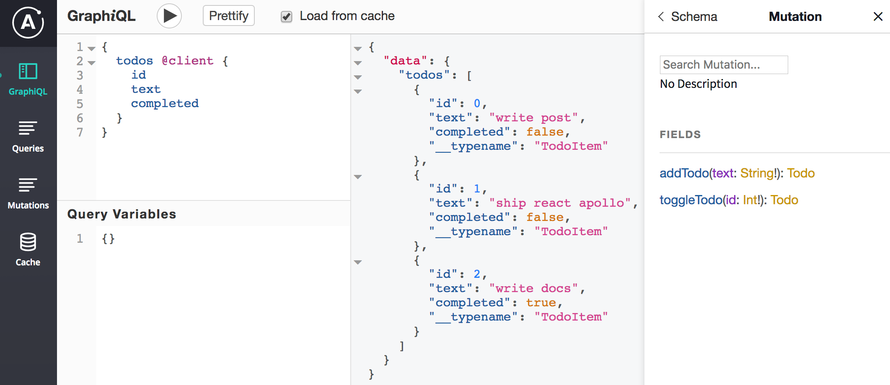

# Local state management

Apollo Client를 사용하여 GraphQL 서버에서 원격 데이터를 관리하는 방법을 배웠지만 로컬 데이터로 무엇을해야합니까? 앱의 여러 구성 요소에서 부울 플래그 및 장치 API 결과에 액세스 할 수 있기를 원하지만 별도의 Redux 또는 MobX 스토어를 유지하고 싶지 않습니다. 이상적으로, 우리는 Apollo 캐시가 클라이언트 응용 프로그램의 모든 데이터에 대한 단일 소스가되기를 원합니다.

Apollo Client \(&gt; = 2.5\)에는 로컬 데이터를 원격 데이터와 함께 Apollo 캐시에 저장할 수있는 로컬 상태 처리 기능이 내장되어 있습니다. 로컬 데이터에 액세스하려면 GraphQL로 쿼리하십시오. 동일한 쿼리 내에서 로컬 및 서버 데이터를 요청할 수도 있습니다!

이 섹션에서는 Apollo Client가 앱에서 로컬 상태 관리를 단순화하는 방법을 설명합니다. 클라이언트 측 리졸버가 로컬 쿼리 및 돌연변이를 실행하는 데 어떻게 도움이되는지 살펴 보겠습니다. @client 지시문을 사용하여 캐시를 쿼리하고 업데이트하는 방법도 배웁니다.

이 문서는 Apollo Client의 로컬 상태 관리 기능을 익히고 참조 안내서로 사용하기 위해 작성되었습니다. Apollo Client로 로컬 상태를 처리하는 방법을 설명하는 단계별 자습서를 찾고 있다면 \(그리고 다른 Apollo 구성 요소를 활용하여 풀 스택 응용 프로그램을 작성하는 경우\) Apollo 자습서를 참조하십시오.

> 로컬 상태 처리 기능을 Apollo Client &lt;2.5와 통합하는 데 관심이있는 경우 \(더 이상 사용되지 않는\) apollo-link-state 프로젝트를 참조하십시오. Apollo Client 2.5부터는 로컬 상태 처리가 핵심에 포함되므로 더 이상 아폴로 링크 상태를 사용할 필요가 없습니다. apollo-link-state에서 Apollo Client 2.5로 마이그레이션하는 데 도움이 필요하면 apollo-link-state에서 마이그레이션 섹션을 참조하십시오.

### Updating local state\(로컬 상태 업데이트\) <a id="updating-local-state"></a>

국소 상태 변이를 수행하는 두 가지 주요 방법이 있습니다. 첫 번째 방법은 cache.writeData를 호출하여 캐시에 직접 쓰는 것입니다. 직접 쓰기는 단일 값 쓰기와 같이 현재 캐시에있는 데이터에 의존하지 않는 일회성 돌연변이에 유용합니다. 두 번째 방법은 useMutation 후크를 로컬 클라이언트 측 리졸버를 호출하는 GraphQL 변이와 함께 활용하는 것입니다. 돌연변이가 캐시에있는 기존 값 \(예 : 목록에 항목 추가 또는 부울 토글\)에 의존하는 경우 리졸버를 사용하는 것이 좋습니다.

#### Direct writes\(직접쓰기\) <a id="direct-writes"></a>

캐시에 직접 쓰려면 GraphQL 변이 또는 리졸버 기능이 필요하지 않습니다. 이들은 useApolloClient 후크에서 반환되고, useQuery 후크 결과에서 사용 가능하게되거나 ApolloConsumer 구성 요소의 렌더 프롭 함수 내에서 리턴 된 클라이언트 특성에 액세스하여 Apollo Client 인스턴스를 직접 활용합니다. 문자열 작성 또는 일회성 쓰기와 같은 간단한 쓰기에이 전략을 사용하는 것이 좋습니다. 직접 쓰기는 기본적으로 GraphQL 돌연변이로 구현되지 않으므로 스키마에 포함하지 않아야합니다. 또한 캐시에 쓰는 데이터가 유효한 GraphQL 데이터의 형태인지 확인하지 않습니다. 이러한 기능 중 하나가 중요한 경우 로컬 리졸버를 대신 사용하도록 선택해야합니다.

```text
import React from "react";
import { useApolloClient } from "@apollo/client";

import Link from "./Link";

function FilterLink({ filter, children }) {
  const client = useApolloClient();
  return (
    <Link
      onClick={() => client.writeData({ data: { visibilityFilter: filter } })}
    >
      {children}
    </Link>
  );
}
```

ApolloConsumer 렌더 소품 기능은 단일 값인 Apollo Client 인스턴스로 호출됩니다. ApolloConsumer 구성 요소는 React 컨텍스트 API의 Consumer 구성 요소와 유사하다고 생각할 수 있습니다. 클라이언트 인스턴스에서 client.writeData를 직접 호출하고 캐시에 쓰려는 데이터를 전달할 수 있습니다.

캐시에 방금 쓴 데이터를 즉시 구독하려면 어떻게해야합니까? 링크의 필터가 캐시의 현재 가시성 필터와 동일한 경우 링크 필터를 활성으로 표시하는 링크에 활성 특성을 작성하십시오. 클라이언트 측 돌연변이를 즉시 구독하기 위해 useQuery를 사용할 수 있습니다. useQuery 후크는 결과 인스턴스에서 클라이언트 인스턴스를 사용할 수있게합니다.

```text
import React from "react";
import { gql, useQuery } from "@apollo/client";

import Link from "./Link";

const GET_VISIBILITY_FILTER = gql`
  {
    visibilityFilter @client
  }
`;

function FilterLink({ filter, children }) {
  const { data, client } = useQuery(GET_VISIBILITY_FILTER);
  return (
    <Link
      onClick={() => client.writeData({ data: { visibilityFilter: filter } })}
      active={data.visibilityFilter === filter}
    >
      {children}
    </Link>
  )
}
```

쿼리에서 가시성 필터 필드 옆에 @client 지시문이 있음을 알 수 있습니다. 이를 통해 Apollo 클라이언트는 필드 데이터를 GraphQL 서버로 보내지 않고 로컬에서 \(캐시에서 또는 로컬 리졸버를 사용하여\) 필드 데이터를 가져 오도록합니다. client.writeData를 호출하면 렌더 소품 함수의 쿼리 결과가 자동으로 업데이트됩니다. 모든 캐시 쓰기 및 읽기는 동기식이므로로드 상태에 대해 걱정할 필요가 없습니다.

Local resolvers

로컬 상태 업데이트를 GraphQL 돌연변이로 구현하려면 로컬 리졸버 맵에서 함수를 지정해야합니다. 리졸버 맵은 각 GraphQL 객체 유형에 대한 리졸버 기능이있는 객체입니다. 이 모든 것이 어떻게 정렬되는지 시각화하려면 GraphQL 쿼리 또는 돌연변이를 각 필드에 대한 함수 호출 트리로 생각하는 것이 좋습니다. 이 함수 호출은 데이터 또는 다른 함수 호출로 해석됩니다. 따라서 GraphQL 쿼리가 Apollo Client를 통해 실행될 때 쿼리의 각 필드에 대해 본질적으로 함수를 실행하는 방법을 찾습니다. 필드에서 @client 지시문을 찾으면 해당 필드에 대해 실행할 수있는 함수를 찾는 내부 리졸버 맵으로 전환됩니다.

로컬 리졸버의 유연성을 높이기 위해 리졸버 기능의 서명은 Apollo Server로 구축 된 서버의 리졸버 기능과 동일합니다. 리졸버 함수의 네 가지 매개 변수를 다시 살펴 보겠습니다.

```text
fieldName: (obj, args, context, info) => result;
```

1. obj : 최상위 쿼리 또는 돌연변이의 경우 상위 필드 또는 ROOT\_QUERY 객체의 리졸버에서 반환 된 결과가 포함 된 객체입니다.

2. args : 필드에 전달 된 모든 인수를 포함하는 객체. 예를 들어 updateNetworkStatus \(isConnected : true\)로 돌연변이를 호출 한 경우 args 객체는 {isConnected : true}가됩니다.

3. context : React 구성 요소와 Apollo 클라이언트 네트워크 스택간에 공유되는 컨텍스트 정보 오브젝트입니다. 존재할 수있는 사용자 정의 컨텍스트 특성 외에도 로컬 해석 프로그램은 항상 다음을 수신합니다.  


* context.client: The Apollo Client instance.
* context.cache: The Apollo Cache instance, which can be used to manipulate the cache with context.cache.readQuery, .writeQuery, .readFragment, .writeFragment, and .writeData. You can learn more about these methods in Managing the cache.
* context.getCacheKey: Get a key from the cache using a \_\_typename and id.

4. info : 쿼리 실행 상태에 대한 정보입니다. 아마도 이것을 사용하지 않아도됩니다.

할일의 완료 상태를 토글하는 리졸버의 예를 살펴 보겠습니다.

```text
import { ApolloClient, InMemoryCache } from '@apollo/client';

const client = new ApolloClient({
  cache: new InMemoryCache(),
  resolvers: {
    Mutation: {
      toggleTodo: (_root, variables, { cache, getCacheKey }) => {
        const id = getCacheKey({ __typename: 'TodoItem', id: variables.id })
        const fragment = gql`
          fragment completeTodo on TodoItem {
            completed
          }
        `;
        const todo = cache.readFragment({ fragment, id });
        const data = { ...todo, completed: !todo.completed };
        cache.writeData({ id, data });
        return null;
      },
    },
  },
});
```

할일의 완료 상태를 전환하려면 먼저 할일의 현재 완료 상태를 확인하기 위해 캐시를 쿼리해야합니다. 이를 위해 cache.readFragment를 사용하여 캐시에서 조각을 읽습니다. 이 함수는 프래그먼트와 id를 가져옵니다. 컨텍스트에있는 getCacheKey를 호출하고 항목의 \_\_typename 및 id를 전달하여 캐시 키를 가져옵니다.

조각을 읽고 나면 할 일의 완료 상태를 토글하고 업데이트 된 데이터를 다시 캐시에 씁니다. UI에서 돌연변이의 리턴 결과를 사용할 계획이 없으므로 모든 GraphQL 유형이 기본적으로 널 입력 가능하므로 널을 리턴합니다.

컴포넌트에서 toggleTodo 돌연변이를 트리거하는 방법을 배우자 :

```text
import React from "react"
import { gql, useMutation } from "@apollo/client";

const TOGGLE_TODO = gql`
  mutation ToggleTodo($id: Int!) {
    toggleTodo(id: $id) @client
  }
`;

function Todo({ id, completed, text }) {
  const [toggleTodo] = useMutation(TOGGLE_TODO, { variables: { id } });
  return (
    <li
      onClick={toggleTodo}
      style={{
        textDecoration: completed ? "line-through" : "none",
      }}
    >
      {text}
    </li>
  );
}
```

먼저, 우리가 유일한 인수로 토글하려는 할일의 ID를 취하는 GraphQL 돌연변이를 만듭니다. @client 지시문으로 필드를 표시하여 이것이 로컬 돌연변이임을 나타냅니다. 그러면 Apollo 클라이언트가 필드를 해결하기 위해 로컬 toggleTodo 돌연변이 해결 프로그램을 호출하도록 지시합니다. 그런 다음 원격 돌연변이와 마찬가지로 useMutation을 사용하여 구성 요소를 만듭니다. 마지막으로 GraphQL 변이를 구성 요소에 전달하고 렌더링 소품 함수의 UI 내에서 트리거합니다.

### Querying local state\(로컬 쿼리 상태\) <a id="querying-local-state"></a>

로컬 데이터 쿼리는 GraphQL 서버 쿼리와 매우 유사합니다. 유일한 차이점은 로컬 필드에 @client 지시문을 추가하여 Apollo 클라이언트 캐시 또는 로컬 확인자 함수에서 해결해야 함을 나타냅니다. 예를 보자.

```text
import React from "react";
import { gql, useQuery } from "@apollo/client";

import Todo from "./Todo";

const GET_TODOS = gql`
  {
    todos @client {
      id
      completed
      text
    }
    visibilityFilter @client
  }
`;

function TodoList() {
  const { data: { todos, visibilityFilter } } = useQuery(GET_TODOS);
  return (
    <ul>
      {getVisibleTodos(todos, visibilityFilter).map(todo => (
        <Todo key={todo.id} {...todo} />
      ))}
    </ul>
  );
}
```

여기서 GraphQL 쿼리를 생성하고 @client 지시문을 todos 및 visibilityFilter에 추가합니다. 그런 다음 쿼리를 useQuery 후크로 전달합니다. 여기서 @client 지시문은 useQuery 구성 요소에 todos 및 visibilityFilter를 Apollo 클라이언트 캐시에서 가져 오거나 사전 정의 된 로컬 리졸버를 사용하여 해결해야 함을 알려줍니다. 다음 섹션에서는 두 옵션이 어떻게 작동하는지 자세히 설명합니다.

> 위의 쿼리는 구성 요소가 마운트되는 즉시 실행 되므로 캐시에 할 일이 없거나 할 일 계산에 도움이되는 로컬 리졸버가없는 경우 어떻게해야합니까? 오류가 발생하지 않도록 쿼리를 실행하기 전에 캐시에 초기 상태를 작성해야합니다. 자세한 내용은 아래 캐시 초기화 섹션을 참조하십시오.

#### Initializing the cache\(캐시 초기화\) <a id="initializing-the-cache"></a>

종종 돌연변이가 트리거되기 전에 데이터를 쿼리하는 구성 요소가 오류를 일으키지 않도록 초기 상태를 캐시에 기록해야합니다. 이를 위해 cache.writeData를 사용하여 캐시를 초기 값으로 준비 할 수 있습니다. 초기 상태의 모양은 응용 프로그램에서 쿼리하려는 방식과 일치해야합니다.

```text
import { ApolloClient, InMemoryCache } from '@apollo/client';

const cache = new InMemoryCache();
const client = new ApolloClient({
  cache,
  resolvers: { /* ... */ },
});

cache.writeData({
  data: {
    todos: [],
    visibilityFilter: 'SHOW_ALL',
    networkStatus: {
      __typename: 'NetworkStatus',
      isConnected: false,
    },
  },
});
```

예를 들어 사용자가 로그 아웃 할 때 애플리케이션에서 상점을 재설정 해야 할 수도 있습니다. 응용 프로그램의 어느 곳에서나 client.resetStore를 호출하면 캐시를 다시 초기화해야 할 것입니다. client.onResetStore 메소드를 사용하여 cache.writeData를 다시 호출 할 콜백을 등록 할 수 있습니다.

```text
import { ApolloClient, InMemoryCache } from '@apollo/client';

const cache = new InMemoryCache();
const client = new ApolloClient({
  cache,
  resolvers: { /* ... */ },
});

const data = {
  todos: [],
  visibilityFilter: 'SHOW_ALL',
  networkStatus: {
    __typename: 'NetworkStatus',
    isConnected: false,
  },
};

cache.writeData({ data });

client.onResetStore(() => cache.writeData({ data }));
```

####  <a id="local-data-query-flow"></a>

@client 지시문이 포함 된 쿼리가 실행될 때 Apollo Client는 몇 가지 순차적 단계를 수행하여 @client 필드에 대한 결과를 찾습니다. 다음 쿼리를 사용하여 로컬 데이터 조회 흐름을 살펴 보겠습니다.

```text
const GET_LAUNCH_DETAILS = gql`
  query LaunchDetails($launchId: ID!) {
    launch(id: $launchId) {
      isInCart @client
      site
      rocket {
        type
      }
    }
  }
`;
```

이 쿼리에는 원격 필드와 로컬 필드가 혼합되어 있습니다. isInCart는 @client 지시문으로 표시된 유일한 필드이므로 집중할 필드입니다. Apollo Client가이 쿼리를 실행하고 isInCart 필드에 대한 결과를 찾으려고 시도하면 다음 단계를 수행합니다.

1. 필드 이름 isInCart와 연관된 분석기 기능이 설정되어 있습니까 \(ApolloClient 생성자 resolvers 매개 변수 또는 Apollo Client의 setResolvers / addResolvers 메소드를 통해\)? 그렇다면 리졸버 함수에서 결과를 실행하고 리턴하십시오.
2. 일치하는 리졸버 기능을 찾을 수 없으면 Apollo 클라이언트 캐시를 검사하여 isInCart 값을 직접 찾을 수 있는지 확인하십시오. 그렇다면 해당 값을 반환하십시오.

이 두 단계를 모두 자세히 살펴 보겠습니다.

* 로컬 리졸버를 사용하여 @client 데이터를 해결하는 방법 \(위의 1 단계\)은 리졸버를 사용하여 @client 필드 처리에 설명되어 있습니다.
* 캐시에서 @client 데이터로드 \(위 2 단계\)는 캐시로 @client 필드 처리에 설명되어 있습니다.

#### Handling `@client` fields with resolvers\(리졸버로 @client 필드 처리\) <a id="handling-client-fields-with-resolvers"></a>

로컬 리졸버는 원격 리졸버와 매우 유사합니다. GraphQL 쿼리를 원격 GraphQL 엔드 포인트로 전송하는 대신, 쿼리에 대해 리졸버 함수를 실행하여 결과 세트를 채우고 리턴하는 대신 Apollo Client는 @client 지시문으로 표시된 필드에 대해 로컬로 정의 된 리졸버 함수를 실행합니다. 예를 보자.

```text
import { ApolloClient, InMemoryCache, HttpLink, gql } from '@apollo/client';

const GET_CART_ITEMS = gql`
  query GetCartItems {
    cartItems @client
  }
`;

const cache = new InMemoryCache();
cache.writeData({
  data: {
    cartItems: [],
  },
});

const client = new ApolloClient({
  cache,
  link: new HttpLink({
    uri: 'http://localhost:4000/graphql',
  }),
  resolvers: {
    Launch: {
      isInCart: (launch, _args, { cache }) => {
        const { cartItems } = cache.readQuery({ query: GET_CART_ITEMS });
        return cartItems.includes(launch.id);
      },
    },
  },
});

const GET_LAUNCH_DETAILS = gql`
  query LaunchDetails($launchId: ID!) {
    launch(id: $launchId) {
      isInCart @client
      site
      rocket {
        type
      }
    }
  }
`;

// ... run the query using client.query, a <Query /> component, etc.
```

여기서 GET\_LAUNCH\_DETAILS 쿼리가 실행될 때 Apollo Client는 isInCart 필드와 관련된 로컬 리졸버를 찾습니다. ApolloClient 생성자에서 isInCart 필드에 대한 로컬 리졸버를 정의 했으므로 사용할 수있는 리졸버를 찾습니다. 이 리졸버 기능이 실행 된 후 결과가 계산되어 나머지 쿼리 결과와 병합됩니다 \(로컬 리졸버를 찾을 수없는 경우 Apollo 클라이언트는 일치하는 필드의 캐시를 확인합니다-자세한 내용은 로컬 데이터 쿼리 흐름 참조\). 세부\).

ApolloClient의 생성자 resolvers 매개 변수 또는 setResolvers / addResolvers 메소드를 통해 리졸버를 설정하면 리졸버가 Apollo Client의 내부 리졸버 맵에 추가됩니다 \(리졸버 맵에 대한 자세한 내용은 로컬 리졸버 섹션 참조\). 위의 예제에서 Launch GraphQL 객체 유형에 대한 isInCart 리졸버를 리졸버 맵에 추가했습니다. isInCart 리졸버 함수를보다 자세히 살펴 보겠습니다.

```text
  resolvers: {
    Launch: {
      isInCart: (launch, _args, { cache }) => {
        const { cartItems } = cache.readQuery({ query: GET_CART_ITEMS });
        return cartItems.includes(launch.id);
      },
    },
  },
```

launch는 나머지 쿼리에 대해 서버에서 반환 된 데이터를 보유하므로이 경우 launch를 사용하여 현재 시작 ID를 얻을 수 있습니다. 이 리졸버에는 인수를 사용하지 않으므로 두 번째 리졸버 파라미터를 건너 뛸 수 있습니다. 그러나 컨텍스트 \(세번째 매개 변수\)에서 캐시 자체를 직접 사용하기 위해 캐시 참조를 사용하고 있습니다. 따라서이 리졸버에서는 모든 장바구니 항목을 가져 오기 위해 캐시를 직접 호출하여로드 된 장바구니 항목 중 하나가 부모 launch.id와 일치하는지 확인하고 그에 따라 true / false를 반환합니다. 그런 다음 반환 된 부울은 원래 쿼리 실행 결과에 다시 통합됩니다.

서버의 리졸버와 마찬가지로 로컬 리졸버는 매우 유연합니다. 지정된 필드에 대한 결과를 반환하기 전에 원하는 모든 종류의 로컬 계산을 수행하는 데 사용할 수 있습니다. 다른 방법으로 캐시를 수동으로 쿼리 \(또는 쓰기\)하고 다른 도우미 유틸리티 또는 라이브러리를 호출하여 데이터를 준비 / 확인 / 정리하고 통계를 추적하며 다른 데이터 저장소를 호출하여 결과를 준비 할 수 있습니다.

@client를 원격 쿼리에 통합 Apollo Client의 로컬 상태 처리 기능을 사용하여 로컬 상태에서만 작업 할 수 있지만 대부분의 Apollo 기반 응용 프로그램은 원격 데이터 소스와 함께 작동하도록 제작되었습니다. 이 문제를 해결하기 위해 Apollo Client는 @client 기반 로컬 리졸버와 원격 쿼리를 혼합하고 @client 기반 필드를 동일한 요청에서 원격 쿼리의 인수로 사용하는 것을 지원합니다.

@client 지시문은 GraphQL 선택 세트 또는 필드에서 사용되어 해당 필드의 결과가 로컬 리졸버의 도움을 받아 로컬로로드되어야 함을 식별 할 수 있습니다.

```text
import { ApolloClient, InMemoryCache, HttpLink, gql } from '@apollo/client';

const MEMBER_DETAILS = gql`
  query Member {
    member {
      name
      role
      isLoggedIn @client
    }
  }
`;

const client = new ApolloClient({
  link: new HttpLink({ uri: 'http://localhost:4000/graphql' }),
  cache: new InMemoryCache(),
  resolvers: {
    Member: {
      isLoggedIn() {
        return someInternalLoginVerificationFunction();
      }
    }
  },
});

// ... run the query using client.query, the <Query /> component, etc.
```

위의 MEMBER\_DETAILS 쿼리가 Apollo Client에 의해 시작되면 \(네트워크 기반 GraphQL API와 통신한다고 가정\) @client isLoggedIn 필드가 먼저 문서에서 제거되고 나머지 쿼리는 네트워크를 통해 GraphQL API로 전송됩니다. 원격 리졸버가 쿼리를 처리하고 결과가 API에서 Apollo Client로 다시 전달되면 원래 쿼리의 @client 부분이 정의 된 로컬 리졸버에 대해 실행되고 결과가 네트워크 결과와 병합되고 최종 결과 데이터는 원래 작업에 대한 응답으로 반환됩니다. 따라서 위의 예제에서 나머지 쿼리가 네트워크 API에 의해 전송되고 처리되기 전에 isLoggedIn이 제거되고 결과가 돌아올 때 isLoggedIn은 리졸버 맵에서 isLoggedIn \(\) 함수를 실행하여 계산됩니다. 로컬 및 네트워크 결과가 병합되어 최종 응답이 애플리케이션에 제공됩니다.

@client 지시문은 전체 선택 세트와 함께 사용할 수도 있습니다.

```text
import { ApolloClient, InMemoryCache, HttpLink, gql } from '@apollo/client';

const MEMBER_DETAILS = gql`
  query Member {
    member {
      name
      role
      session @client {
        isLoggedIn
        connectionCount
        errors
      }
    }
  }
`;

const client = new ApolloClient({
  link: new HttpLink({ uri: 'http://localhost:4000/graphql' }),
  cache: new InMemoryCache(),
  resolvers: {
    Member: {
      session() {
        return {
          __typename: 'Session',
          isLoggedIn: someInternalLoginVerificationFunction(),
          connectionCount: calculateOpenConnections(),
          errors: sessionError(),
        };
      }
    }
  },
});
```

Apollo Client는 쿼리, 돌연변이 및 가입에 대한 로컬 @client 결과 및 원격 결과 병합을 지원합니다.

비동기 로컬 리졸

Apollo Client는 비동기 로컬 리졸버 기능을 지원합니다. 이 함수는 비동기 함수이거나 Promise를 반환하는 일반 함수일 수 있습니다. 비동기 리졸버는 비동기 API에서 데이터를 반환해야 할 때 유용합니다.

> 리졸버에서 REST 엔드 포인트를 수행하려면 대신 apollo-link-rest를 확인하는 것이 좋습니다. 이는 Apollo Client와 함께 REST 엔드 포인트를 사용하기위한보다 완벽한 솔루션입니다.

React Native 및 대부분의 브라우저 API의 경우 컴포넌트 라이프 사이클 메소드에서 리스너를 설정하고 비동기 리졸버를 사용하는 대신 돌연변이 트리거 함수를 콜백으로 전달해야합니다. 그러나 비동기 리졸버 함수는 종종 비동기 장치 API를 소비하는 가장 편리한 방법입니다.

```text
import { ApolloClient, InMemoryCache } from '@apollo/client';
import { CameraRoll } from 'react-native';

const client = new ApolloClient({
  cache: new InMemoryCache(),
  resolvers: {
    Query: {
      async cameraRoll(_, { assetType }) {
        try {
          const media = await CameraRoll.getPhotos({
            first: 20,
            assetType,
          });

          return {
            ...media,
            id: assetType,
            __typename: 'CameraRoll',
          };
        } catch (e) {
          console.error(e);
          return null;
        }
      },
    },
  },
});
```

CameraRoll.getPhotos \(\)는 카메라 노드 객체의 배열 인 edges 속성과 페이지 정보가있는 객체 인 page\_info 속성을 사용하여 객체에 대한 Promise를 반환합니다. 이는 컴포넌트가 소비하는 데이터로만 리턴 값을 필터링 할 수 있기 때문에 GraphQL의 훌륭한 사용 사례입니다.

```text
import { gql } from "@apollo/client";

const GET_PHOTOS = gql`
  query getPhotos($assetType: String!) {
    cameraRoll(assetType: $assetType) @client {
      id
      edges {
        node {
          image {
            uri
          }
          location {
            latitude
            longitude
          }
        }
      }
    }
  }
`;
```

#### Handling `@client` fields with the cache\(캐시로 @client 필처리\) <a id="handling-client-fields-with-the-cache"></a>

리졸버를 사용하여 @client 필드 처리에 설명 된대로 @client 필드는 로컬 리졸버 기능을 사용하여 해결할 수 있습니다. 그러나 @client 지시문을 사용할 때 로컬 리졸버가 항상 필요한 것은 아니라는 점에 유의해야합니다. @client로 표시된 필드는 캐시에서 직접 일치하는 값을 가져와 로컬에서 여전히 확인할 수 있습니다. 예를 들면 다음과 같습니다.

```text
import React from "react";
import ReactDOM from "react-dom";
import {
  ApolloClient,
  InMemoryCache,
  HttpLink,
  ApolloProvider,
  useQuery,
  gql
} from "@apollo/client";

import Pages from "./pages";
import Login from "./pages/login";

const cache = new InMemoryCache();
const client = new ApolloClient({
  cache,
  link: new HttpLink({ uri: "http://localhost:4000/graphql" }),
  resolvers: {},
});

cache.writeData({
  data: {
    isLoggedIn: !!localStorage.getItem("token"),
  },
});

const IS_LOGGED_IN = gql`
  query IsUserLoggedIn {
    isLoggedIn @client
  }
`;

function App() {
  const { data } = useQuery(IS_LOGGED_IN);
  return data.isLoggedIn ? <Pages /> : <Login />;
}

ReactDOM.render(
  <ApolloProvider client={client}>
    <App />
  </ApolloProvider>,
  document.getElementById("root"),
);
```

위의 예에서 먼저 cache.writeData를 사용하여 캐시를 준비하여 isLoggedIn 필드의 값을 저장합니다. 그런 다음 @client 지시문이 포함 된 Apollo Client useQuery 후크를 통해 IS\_LOGGED\_IN 쿼리를 실행합니다. Apollo Client는 IS\_LOGGED\_IN 쿼리를 실행할 때 먼저 @client 필드를 처리하는 데 사용할 수있는 로컬 확인자를 찾습니다. 하나를 찾을 수 없으면 캐시에서 지정된 필드를 가져 오려고 시도합니다. 따라서이 경우 useQuery 후크가 리턴 한 데이터 값에는 캐시에서 직접 가져온 isLoggedIn 결과 \(!! localStorage.getItem \( 'token'\)\)를 포함하는 isLoggedIn 특성이 있습니다.

로컬 확인자를 사용하지 않고 Apollo Client의 @client 지원을 사용하여 캐시를 쿼리하려면 빈 개체를 ApolloClient 생성자 확인자 옵션에 전달해야합니다. 이 Apollo Client가 없으면 통합 @client 지원을 활성화하지 않으므로 @client 기반 쿼리가 Apollo Client 링크 체인으로 전달됩니다. 이것이 필요한 이유에 대한 자세한 내용은 여기를 참조하십시오.

로컬 리졸버가 결과를 반환하기 전에 추가 계산을 수행 할 수 있기 때문에 @client 필드 값을 캐시에서 직접 가져 오는 것은 로컬 리졸버 기능만큼 유연하지 않습니다. 그러나 애플리케이션의 요구에 따라 @client 필드를 캐시에서 직접로드하는 것이 더 간단한 옵션 일 수 있습니다. Apollo Client는 두 가지 방법의 결합을 제한하지 않으므로 자유롭게 혼합하고 일치시킬 수 있습니다. 필요한 경우 캐시에서 @client 값을 가져 와서 동일한 쿼리에서 로컬 리졸버로 다른 값을 확인할 수 있습니다.

#### Working with fetch policies\(가져오기 정책에 대한 작업\) <a id="working-with-fetch-policies"></a>

Apollo Client가 쿼리를 실행하기 전에 가장 먼저 수행해야 할 작업 중 하나는 사용하도록 구성된 fetchPolicy를 확인하는 것입니다. 이를 수행하여 캐시 또는 네트워크에서 쿼리를 어디에서 해결해야하는지 알 수 있습니다. 쿼리를 실행할 때 Apollo Client는 @resource 기반 로컬 리졸버를 원격 리졸버와 마찬가지로 처리합니다. 정의 된 fetchPolicy를 준수하여 데이터를 처음부터 가져 오는 위치를 알 수 있습니다. 로컬 리졸버로 작업 할 때 기본적으로 로컬 리졸버 기능이 모든 요청에서 실행되는 것은 아니기 때문에 페치 정책이 리졸버 기능 실행에 미치는 영향을 이해하는 것이 중요합니다. 로컬 리졸버를 실행 한 결과는 나머지 쿼리 결과와 함께 캐시되고 다음 요청시 캐시에서 가져 오기 때문입니다. 예를 보자.

```text
import React, { Fragment } from "react";
import { useQuery, gql } from "@apollo/client";

import { Loading, Header, LaunchDetail } from "../components";
import { ActionButton } from "../containers";

export const GET_LAUNCH_DETAILS = gql`
  query LaunchDetails($launchId: ID!) {
    launch(id: $launchId) {
      isInCart @client
      site
      rocket {
        type
      }
    }
  }
`;

export default function Launch({ launchId }) {
  const { loading, error, data } = useQuery(
    GET_LAUNCH_DETAILS,
    { variables: { launchId } }
  );

  if (loading) return <Loading />;
  if (error) return <p>ERROR: {error.message}</p>;

  return (
    <Fragment>
      <Header image={data.launch.mission.missionPatch}>
        {data.launch.mission.name}
      </Header>
      <LaunchDetail {...data.launch} />
      <ActionButton {...data.launch} />
    </Fragment>
  );
}
```

위의 예에서 우리는 GET\_LAUNCH\_DETAILS 쿼리를 실행하기 위해 Apollo Client useQuery 후크를 사용하고 있습니다. @client based isInCart 필드는 다음 리졸버에서 데이터를 가져 오도록 구성됩니다.

```text
import { GET_CART_ITEMS } from './pages/cart';

export const resolvers = {
  Launch: {
    isInCart: (launch, _, { cache }) => {
      const { cartItems } = cache.readQuery({ query: GET_CART_ITEMS });
      return cartItems.includes(launch.id);
    },
  },
};
```

빈 캐시로 시작한다고 가정 해 봅시다. useQuery 호출에서 fetchPolicy prop을 지정하지 않았으므로 Apollo Client의 기본 캐시 우선 fetchPolicy를 사용하고 있습니다. 이는 GET\_LAUNCH\_DETAILS 쿼리가 실행될 때 캐시를 먼저 확인하여 결과를 찾을 수 있는지 확인합니다. 캐시가 확인되면 전체 쿼리가 캐시에 대해 실행되지만 @client 관련 로컬 리졸버는 건너 뜁니다 \(실행되지 않음\). 따라서 캐시는 다음과 같이 쿼리됩니다 \(@client 지시문이 지정되지 않은 것처럼\).

```text
launch(id: $launchId) {
  isInCart
  site
  rocket {
    type
  }
}
```

이 경우 캐시에서 결과를 추출 할 수 없으므로 \(캐시가 비어 있기 때문에\) Apollo Client는 쿼리 실행 경로 아래로 이동합니다. 다음 단계에서는 원래 쿼리를 본질적으로 @client 필드가있는 부분과 네트워크를 통해 실행될 부분의 두 부분으로 나눕니다. 그런 다음 두 부분이 모두 실행됩니다. 결과는 네트워크에서 가져오고 결과는 로컬 리졸버를 실행하여 계산됩니다. 로컬 리졸버와 네트워크의 결과는 함께 병합되고 최종 결과는 캐시에 기록되고 반환됩니다. 따라서 처음 실행 한 후에는 원래 쿼리에 대한 캐시가 생성되며 여기에는 쿼리의 @client 부분과 네트워크 부분에 대한 데이터가 포함됩니다.

GET\_LAUNCH\_DETAILS 쿼리가 두 번째로 실행될 때, Apollo Client의 기본 fetchPolicy 인 cache-first를 사용하고 있으므로 캐시가 먼저 검사되어 결과가 나옵니다. 이번에는 쿼리에 대한 전체 결과를 찾을 수 있으므로 useQuery 호출을 통해 결과가 반환됩니다. 우리가 찾고있는 결과를 이미 캐시에서 추출 할 수 있기 때문에 @client 필드 로컬 리졸버가 시작되지 않습니다.

원격 리졸버와 같은 로컬 리졸버를 동일한 fetchPolicy를 준수함으로써 처리하는 많은 상황에서 많은 의미가 있습니다. 원격으로 가져 오거나 로컬 리졸버를 사용하여 계산 한 데이터를 찾은 후에는 캐시하고 후속 요청에서 다시 계산 / 재 페치하지 않도록 할 수 있습니다. 그러나 모든 요청에서 실행해야하는 계산을 실행하기 위해 로컬 리졸버를 사용하는 경우 어떻게해야합니까? 이를 처리 할 수있는 몇 가지 방법이 있습니다. 캐시없이 또는 네트워크 전용과 같이 각 요청에서 전체 쿼리가 실행되도록하는 fetchPolicy를 사용하도록 쿼리를 전환 할 수 있습니다. 이렇게하면 요청이있을 때마다 로컬 확인자가 실행되지만 네트워크 기반 쿼리 구성 요소가 모든 요청에 ​​대해 실행되도록해야합니다. 사용 사례에 따라 괜찮을 수도 있지만 쿼리의 네트워크 부분에서 캐시를 활용하고 모든 요청에서 @client 부분을 실행하려면 어떻게해야합니까? @client \(always : true\)를 사용한 해결 자 섹션에서보다 유연한 옵션을 다룰 것입니다.

#### Forcing resolvers with  <a id="forcing-resolvers-with-clientalways-true"></a>

Apollo Client는 캐시를 활용하여 동일한 데이터를 지속적으로 요청할 때 필요한 네트워크 오버 헤드를 줄입니다. 기본적으로 @client 기반 필드는 원격 필드와 동일한 방식으로 캐시를 활용합니다. 로컬 리졸버가 실행 된 후 결과는 모든 원격 결과와 함께 캐시됩니다. 이렇게하면 다음에 캐시에서 결과를 찾을 수있는 쿼리가 실행될 때 해당 결과가 사용되며 연결된 로컬 리졸버가 다시 시작되지 않습니다 \(데이터가 캐시에서 제거되거나 쿼리가 캐시 없음 또는 네트워크 전용 fetchPolicy\).

로컬 및 원격 결과 모두에 캐시를 활용하는 것이 많은 경우에 매우 유용 할 수 있지만 항상 가장 적합한 것은 아닙니다. 로컬 리졸버를 사용하여 모든 요청에서 새로 고쳐야하는 동적 값을 계산하고 동시에 쿼리의 네트워크 기반 부분에 캐시를 계속 사용할 수 있습니다. 이 사용 사례를 지원하기 위해 Apollo Client의 @client 지시문은 always 인수를 허용합니다. true로 설정하면 연관된 로컬 리졸버가 모든 요청에서 실행되도록합니다. 예를 보면 :

```text
import { ApolloClient, InMemoryCache, gql } from '@apollo/client';

const client = new ApolloClient({
  cache: new InMemoryCache(),
  resolvers: {
    Query: {
      isLoggedIn() {
        return !!localStorage.getItem('token');
      },
    },
  },
});

const IS_LOGGED_IN = gql`
  query IsUserLoggedIn {
    isLoggedIn @client(always: true)
  }
`;

// ... run the query using client.query, a <Query /> component, etc.
```

위의 isLoggedIn 리졸버는 localStorage에 인증 토큰이 있는지 확인합니다. 이 예에서는 IS\_LOGGED\_IN 쿼리가 실행될 때마다 isLoggedIn 로컬 리졸버도 실행되어 최신 로그인 정보를 갖도록합니다. 이를 위해 쿼리에서 isLoggedIn 필드에 @client \(always : true\) 지시문을 사용합니다. always : true를 포함하지 않으면 로컬 리졸버는 fetchPolicy 쿼리를 기반으로 실행되므로 isLoggedIn에 대해 캐시 된 값을 다시 가져올 수 있습니다. @client \(always : true\)를 사용하면 항상 연결된 로컬 리졸버를 실행 한 직접적인 결과를 얻을 수 있습니다.

> @client \(항상 true\)를 사용할 때의 영향을 신중하게 고려하십시오. 모든 요청에서 로컬 리졸버를 강제 실행하는 것이 유용 할 수 있지만, 리졸버가 계산 비용이 많이 들거나 부작용이있는 경우 애플리케이션에 부정적인 영향을 줄 수 있습니다. 로컬 리졸버를 사용할 때 애플리케이션 성능에 도움이되도록 캐시를 최대한 활용하는 것이 좋습니다. @client \(always : true\)는 툴 벨트에 유용하지만 로컬 리졸버가 쿼리 fetchPolicy를 준수하도록하는 것이 좋습니다.`@client(always: true)(리졸버 강제하)`

@client \(always : true\)는 로컬 리졸버가 항상 실행되도록 보장하지만 쿼리가 캐시를 먼저 이용하는 fetchPolicy를 사용하는 경우 \(캐시 우선, 캐시 및 네트워크, 캐시 전용\), 로컬 리졸버가 시작되기 전에 먼저 캐시에서 쿼리를 해결하려고 시도합니다. 이는 @client \(always : true\) 사용이 동일한 쿼리에서 일반 @client 사용과 혼합 될 수 있기 때문에 발생합니다. 즉, 쿼리의 일부가 정의 된 fetchPolicy를 준수하기를 원합니다. 이것의 장점은 캐시에서 먼저로드 할 수있는 모든 것을 첫 번째 매개 변수로 @client \(always : true\) 리졸버 함수에서 사용할 수 있다는 것입니다. 따라서 @client \(always : true\)를 사용하여 항상 특정 리졸버를 실행 하려는지 식별했지만 해당 리졸버 내에서 쿼리에 대해로드 된 캐시 값을보고 실행을 진행할지 여부를 결정할 수 있습니다. 리졸버.

#### Using `@client` fields as variables`(@client 수로 사용)` <a id="using-client-fields-as-variables"></a>

Apollo Client는 동일한 작업에서 @client 필드 결과를 선택 세트 또는 필드의 변수로 사용하는 방법을 제공합니다. 따라서 @client 기반 쿼리를 먼저 실행하고 로컬 결과를 가져온 다음로드 된 로컬 결과를 변수로 사용하여 두 번째 쿼리를 실행하는 대신 모든 요청을 한 번의 요청으로 처리 할 수 있습니다. 이는 @client 지시문을 @export \(as : "variableName"\) 지시문과 결합하여 수행됩니다.

```text
import { ApolloClient, InMemoryCache, HttpLink, gql } from '@apollo/client';

const query = gql`
  query currentAuthorPostCount($authorId: Int!) {
    currentAuthorId @client @export(as: "authorId")
    postCount(authorId: $authorId)
  }
`;

const cache = new InMemoryCache();
const client = new ApolloClient({
  link: new HttpLink({ uri: 'http://localhost:4000/graphql' }),
  cache,
  resolvers: {},
});

cache.writeData({
  data: {
    currentAuthorId: 12345,
  },
});

// ... run the query using client.query, the <Query /> component, etc.
```

위의 예에서 currentAuthorId는 먼저 캐시에서로드 된 다음 authorPost 변수 \(@export \(as : "authorId"\) 지시문으로 지정됨\)로 후속 postCount 필드에 전달됩니다. @export 지시문은 다음과 같이 선택 세트 내의 특정 필드에서 사용할 수도 있습니다.

```text
import { ApolloClient, InMemoryCache, HttpLink, gql } from '@apollo/client';

const query = gql`
  query currentAuthorPostCount($authorId: Int!) {
    currentAuthor @client {
      name
      authorId @export(as: "authorId")
    }
    postCount(authorId: $authorId)
  }
`;

const cache = new InMemoryCache();
const client = new ApolloClient({
  link: new HttpLink({ uri: 'http://localhost:4000/graphql' }),
  cache,
  resolvers: {},
});

cache.writeData({
  data: {
    currentAuthor: {
      __typename: 'Author',
      name: 'John Smith',
      authorId: 12345,
    },
  },
});

// ... run the query using client.query, the <Query /> component, etc.
```

여기서 authorId 변수는 캐시 저장된 currentAuthor에서로드 된 authorId 필드에서 설정됩니다. @export 변수 사용은 원격 쿼리로 제한되지 않습니다. 다른 @client 필드 또는 선택 세트에 대한 변수를 정의하는 데 사용될 수도 있습니다.

```text
import { ApolloClient, InMemoryCache, HttpLink, gql } from '@apollo/client';

const query = gql`
  query currentAuthorPostCount($authorId: Int!) {
    currentAuthorId @client @export(as: "authorId")
    postCount(authorId: $authorId) @client
  }
`;

const cache = new InMemoryCache();
const client = new ApolloClient({
  cache,
  resolvers: {
    Query: {
      postCount(_, { authorId }) {
        return authorId === 12345 ? 100 : 0;
      },
    },
  },
});

cache.writeData({
  data: {
    currentAuthorId: 12345,
  },
});

// ... run the query using client.query, the <Query /> component, etc.
```

따라서 여기서 currentAuthorId는 캐시에서로드 된 다음 authorCount로 postCount 로컬 리졸버에 전달됩니다.

**@export 사용에 대한 몇 가지 중요한 참고 사항 :**

1.Apollo Client는 현재 로컬 데이터에 대한 변수를 저장하기 위해 @export 지시문 사용 만 지원합니다. @export는 @client와 함께 사용해야합니다.

2.@client @export 사용은 작업의 실행 순서가 결과에 영향을 줄 수있는 것처럼 보이기 때문에 GraphQL 사양에 맞지 않는 것처럼 보일 수 있습니다. GraphQL 스펙의 일반 및 직렬 실행 섹션에서 :

> ... 최상위 돌연변이 필드 이외의 필드의 해상도는 항상 부작용이없고 dem 등원이어야하며, 실행 순서는 결과에 영향을 미치지 않아야합니다. 따라서 서버는 필드 순서에 상관없이 필드 항목을 자유롭게 실행할 수 있습니다. 최적.

Apollo Client는 현재 @client 지시문과 혼합 된 경우 @export 지시문의 사용 만 지원합니다. 먼저 @client @export 지시문이있는 작업을 실행하고 지정된 @export 변수를 추출한 다음 로컬 캐시 또는 로컬 리졸버에서 해당 변수의 값을 확인하여 @export 변수를 준비합니다. 변수 이름의 로컬 값에 대한 맵이 작성되면 해당 맵을 사용하여 서버 기반 GraphQL 쿼리를 실행할 때 전달 된 변수를 채 웁니다. 서버 기반 GraphQL 쿼리의 실행 순서는 @export 사용의 영향을받지 않습니다. 변수는 서버 쿼리가 실행되기 전에 준비되고 구성되므로 사양을 준수합니다.

3.한 번의 작업으로 동일한 이름을 사용하는 여러 @export 변수를 정의하면 마지막 @export 변수의 값이 앞으로 변수 값으로 사용됩니다. 이러한 상황이 발생하면 Apollo Client는 경고 메시지를 기록합니다 \(dev 전용\).

### Managing the cache\(캐시 관리\) <a id="managing-the-cache"></a>

Apollo Client를 사용하여 로컬 상태로 작업 할 때 Apollo 캐시는 모든 로컬 및 원격 데이터에 대한 단일 진실 소스가됩니다. Apollo 캐시 API에는 데이터 업데이트 및 검색을 지원할 수있는 몇 가지 메소드가 있습니다. 가장 관련성이 높은 방법을 살펴보고 각각에 대한 일반적인 사용 사례를 살펴 보겠습니다.

#### writeData <a id="writedata"></a>

캐시를 업데이트하는 가장 쉬운 방법은 cache.writeData를 사용하여 쿼리를 전달하지 않고 캐시에 직접 데이터를 쓸 수 있습니다. 간단한 업데이트를 위해 리졸버 맵에서 사용하는 방법은 다음과 같습니다.

```text
import { ApolloClient, InMemoryCache } from '@apollo/client';

const client = new ApolloClient({
  cache: new InMemoryCache(),
  resolvers: {
    Mutation: {
      updateVisibilityFilter: (_, { visibilityFilter }, { cache }) => {
        const data = { visibilityFilter, __typename: 'Filter' };
        cache.writeData({ data });
      },
    },
  },
};
```

cache.writeData를 사용하면 선택적 id 속성을 전달하여 조각을 캐시의 기존 객체에 쓸 수 있습니다. 이것은 클라이언트 측 필드를 캐시의 기존 객체에 추가하려는 경우에 유용합니다.

ID는 객체의 캐시 키와 일치해야합니다. InMemoryCache를 사용하고 dataIdFromObject 구성 속성을 재정의하지 않는 경우 캐시 키는 \_\_typename : id 여야합니다.

```text
import { ApolloClient, InMemoryCache } from '@apollo/client';

const client = new ApolloClient({
  cache: new InMemoryCache(),
  resolvers: {
    Mutation: {
      updateUserEmail: (_, { id, email }, { cache }) => {
        const data = { email };
        cache.writeData({ id: `User:${id}`, data });
      },
    },
  },
};
```

cache.writeData는 대부분의 요구를 충족해야합니다. 그러나 캐시에 쓰는 데이터가 이미 존재하는 데이터에 의존하는 경우가 있습니다. 이 시나리오에서는 readQuery 또는 readFragment를 사용해야합니다.이를 통해 쿼리 또는 조각을 전달하여 캐시에서 데이터를 읽을 수 있습니다. 캐시에 쓰고있는 데이터의 형태를 확인하려면 writeQuery 또는 writeFragment를 사용하십시오. 아래에서 이러한 사용 사례 중 일부에 대해 설명합니다.

#### writeQuery and readQuery <a id="writequery-and-readquery"></a>

때로는 캐시에 쓰는 데이터가 이미 캐시에있는 데이터에 의존합니다. 예를 들어, 목록에 항목을 추가하거나 기존 속성 값을 기반으로 속성을 설정합니다. 이 경우 데이터를 쓰기 전에 cache.readQuery를 사용하여 쿼리를 전달하고 캐시에서 값을 읽어야합니다. 목록에 할 일을 추가하는 예를 살펴 보겠습니다.

```text
import { ApolloClient, InMemoryCache, gql } from '@apollo/client';

let nextTodoId = 0;

const cache = new InMemoryCache();
cache.writeData({
  data: {
    todos: [],
  },
});

const client = new ApolloClient({
  resolvers: {
    Mutation: {
      addTodo: (_, { text }, { cache }) => {
        const query = gql`
          query GetTodos {
            todos @client {
              id
              text
              completed
            }
          }
        `;

        const previous = cache.readQuery({ query });
        const newTodo = { id: nextTodoId++, text, completed: false, __typename: 'TodoItem' };
        const data = {
          todos: [...previous.todos, newTodo],
        };

        // you can also do cache.writeData({ data }) here if you prefer
        cache.writeQuery({ query, data });
        return newTodo;
      },
    },
  },
});
```

할 일을 목록에 추가하려면 현재 캐시에있는 할 일이 필요합니다. 그래서 우리는 cache.readQuery를 호출하여이를 검색합니다. 데이터가 캐시에 없으면 cache.readQuery에서 오류가 발생하므로 초기 상태를 제공해야합니다. 이것이 바로 InMemoryCache를 생성 한 후 빈 todo 배열로 cache.writeData를 호출하는 이유입니다.

데이터를 캐시에 쓰려면 cache.writeQuery 또는 cache.writeData를 사용할 수 있습니다. 이 둘의 유일한 차이점은 cache.writeQuery에서 캐시에 쓰는 데이터의 모양이 쿼리에 필요한 데이터의 모양과 동일한 지 확인하기 위해 쿼리를 전달해야한다는 것입니다. 후드 아래에서 cache.writeData는 전달한 데이터 객체에서 자동으로 쿼리를 생성하고 cache.writeQuery를 호출합니다.

#### writeFragment and readFragment <a id="writefragment-and-readfragment"></a>

cache.readFragment는 조각을 전달한다는 점을 제외하고 cache.readQuery와 유사합니다. 캐시 키가 있으면 캐시의 모든 항목을 읽을 수 있으므로 유연성이 향상됩니다. 반대로 cache.readQuery는 캐시의 루트에서만 읽을 수 있습니다.

이전의 할 일 목록 예제로 돌아가서 cache.readFragment가 할 일 중 하나를 완료 할 때 어떻게 전환 할 수 있는지 살펴 보겠습니다.

```text
import { ApolloClient, InMemoryCache } from '@apollo/client';

const client = new ApolloClient({
  resolvers: {
    Mutation: {
      toggleTodo: (_, variables, { cache }) => {
        const id = `TodoItem:${variables.id}`;
        const fragment = gql`
          fragment completeTodo on TodoItem {
            completed
          }
        `;
        const todo = cache.readFragment({ fragment, id });
        const data = { ...todo, completed: !todo.completed };

        // you can also do cache.writeData({ data, id }) here if you prefer
        cache.writeFragment({ fragment, id, data });
        return null;
      },
    },
  },
});
```

할 일을 토글하려면 캐시에서 할 일과 그 상태가 필요합니다. 그래서 우리는 cache.readFragment를 호출하고 조각을 가져 와서 검색합니다. 우리가 cache.readFragment에 전달하는 ID는 캐시 키를 나타냅니다. InMemoryCache를 사용하고 dataIdFromObject 구성 속성을 재정의하지 않는 경우 캐시 키는 \_\_typename : id 여야합니다.

데이터를 캐시에 쓰려면 cache.writeFragment 또는 cache.writeData를 사용할 수 있습니다. 이 둘의 유일한 차이점은 cache.writeFragment에서 캐시 노드에 쓰는 데이터의 모양이 조각에 필요한 데이터의 모양과 동일한 지 확인하기 위해 조각을 전달해야한다는 것입니다. 후드 아래에서 cache.writeData는 자동으로 전달하는 데이터 객체 및 ID에서 조각을 생성하고 cache.writeFragment를 호출합니다.

### Client-side schema <a id="client-side-schema"></a>

ApolloClient 생성자 typeDefs 매개 변수 또는 로컬 상태 API setTypeDefs 메서드를 통해 Apollo Client와 함께 사용할 클라이언트 쪽 스키마를 선택적으로 설정할 수 있습니다. 스키마는 스키마 정의 언어로 작성해야합니다. 스키마 유효성 검사를위한 graphql-js 모듈은 번들 크기를 크게 증가시키기 때문에이 스키마는 서버에서와 같이 유효성 검사에 사용되지 않습니다. 대신 클라이언트 측 스키마는 Apollo Client Devtools의 내부 검사에 사용되며 GraphiQL에서 스키마를 탐색 할 수 있습니다.

다음은 ApolloClient 생성자를 통해 클라이언트 측 스키마를 구성하는 방법을 보여줍니다.

```text
import { ApolloClient, InMemoryCache, HttpLink, gql } from '@apollo/client';

const typeDefs = gql`
  extend type Query {
    isLoggedIn: Boolean!
    cartItems: [Launch]!
  }

  extend type Launch {
    isInCart: Boolean!
  }

  extend type Mutation {
    addOrRemoveFromCart(id: ID!): [Launch]
  }
`;

const client = new ApolloClient({
  cache: new InMemoryCache(),
  link: new HttpLink({ uri: 'http://localhost:4000/graphql' }),
  typeDefs,
});
```

Apollo Client Devtools를 열고 GraphiQL 탭을 클릭하면 "문서"섹션에서 클라이언트 스키마를 탐색 할 수 있습니다. 이 예제에는 원격 스키마가 포함되어 있지 않지만 원격 스키마가 포함되어 있으면 원격 쿼리와 함께 로컬 쿼리 및 변이를 볼 수 있습니다.



### Advanced <a id="advanced"></a>

#### Code splitting\(코드 분할\) <a id="code-splitting"></a>

로컬 리졸버의 복잡성과 크기에 따라 초기 ApolloClient 인스턴스를 생성 할 때 항상이를 미리 정의하지 않을 수도 있습니다. 응용 프로그램의 특정 부분에만 필요한 로컬 리졸버가있는 경우 언제든지 Apollo Client의 addResolvers 및 setResolvers 함수를 사용하여 리졸버 맵을 조정할 수 있습니다. 리 액트 로딩 가능과 같은 것을 사용하여 경로 기반 코드 분할과 같은 기술을 활용할 때 실제로 유용 할 수 있습니다.

메시징 앱을 구축 중이고 로컬에 저장된 총 메시지 수를 반환하는 데 사용되는 / stats 경로가 있다고 가정 해 보겠습니다. react-loadable을 사용하여 Stats 컴포넌트를 다음과 같이로드합니다 :

```text
import React from "react";
import { ApolloConsumer, useApolloClient, useQuery, gql } from "@apollo/client";

const GET_MESSAGE_COUNT = gql`
  {
    messageCount @client {
      total
    }
  }
`;

const resolvers = {
  Query: {
    messageCount: (_, args, { cache }) => {
      // ... calculate and return the number of messages in
      // the cache ...
      return {
        total: 123,
        __typename: "MessageCount",
      };
    },
  },
};

export function MessageCount() {
  const client = useApolloClient();
  client.addResolvers(resolvers);

  const { loading, data: { messageCount } } = useQuery(GET_MESSAGE_COUNT);

  if (loading) return "Loading ...";

  return (
    <p>
      Total number of messages: {messageCount.total}
    </p>
  );
};
```

로컬 리졸버 코드는 사용자가 / stats에 액세스 할 때 다운로드하는 번들에만 포함됩니다. 초기 응용 프로그램 번들에 포함되지 않으므로 초기 번들 크기를 줄이고 궁극적으로 다운로드 및 응용 프로그램 시작 시간을 도와줍니다.

### Migrating from `apollo-link-state` <a id="migrating-from-apollo-link-state"></a>

apollo-link-state 프로젝트는 로컬 상태 처리를 아폴로 생태계에 도입 한 최초의 프로젝트였습니다. ApolloLink를 추가하여 로컬 리졸버를 처리하는 것은 훌륭한 출발점이며 @client 기반 쿼리가 의미가 있고 로컬 상태 관리에 실제로 효과적이라는 것을 증명했습니다.

아폴로 링크 상태는 로컬 상태 처리의 목표 중 일부를 달성했지만, ApolloLink를 사용할 때 사용 가능한 정보는 링크 시스템의 모듈성에 의해 제한됩니다. 로컬 상태 관리는 Apollo 에코 시스템의 핵심 부분으로 간주되며 Apollo Client가 진행됨에 따라 로컬 리졸버가 가능한 한 코어에 밀접하게 통합되도록합니다. 이 통합은 @export 처리와 같은 새로운 가능성을 열어주고 데이터 보존, 무효화, 가비지 수집 및 로컬 및 원격 데이터 모두에 영향을주는 기타 계획된 기능을 캐시하기 위해 향후 계획된 조정과 밀접하게 연계됩니다.

apollo-link-state 대신 Apollo Client의 로컬 상태 관리 기능을 사용하도록 응용 프로그램을 업데이트하는 것은 매우 간단합니다. 필요한 단계는 다음과 같습니다.

1. apollo-link-state를 종속성으로 포함하고 ClientState와 함께 사용하기 위해 가져 오는 것은 더 이상 필요하지 않습니다. 로컬 상태 관리가 apollo-client&gt; = 2.5.0 및 @ apollo / client&gt; = 3.0.0에 포함되어 있으므로 apollo-link-state 종속성을 제거 할 수 있습니다.

2. withClientState 사용은 더 이상 지원되지 않습니다. 다음과 같은:

```text
const cache = new InMemoryCache();
const stateLink = withClientState({ cache, resolvers: { ... } });
const link = ApolloLink.from([stateLink, new HttpLink({ uri: '...' })]);
const client = new ApolloClient({
  cache,
  link,
});
```

becomes

```text
const client = new ApolloClient({
  cache: new InMemoryCache(),
  link: new HttpLink({ uri: '...' }),
  resolvers: { ... },
});
```

3. 기본값은 더 이상 지원되지 않습니다. 캐시를 준비하려면 cache.writeData를 직접 사용하십시오. 그래서

```text
const cache = new InMemoryCache();
const stateLink = withClientState({
  cache,
  resolvers: { ... },
  defaults: {
    someField: 'some value',
  },
});
const link = ApolloLink.from([stateLink, new HttpLink({ uri: '...' })]);
const client = new ApolloClient({
  cache,
  link,
});
```

becomes

```text
const cache = new InMemoryCache();
const client = new ApolloClient({
  cache,
  link: new HttpLink({ uri: '...' }),
  resolvers: { ... },
});
cache.writeData({
  data: {
    someField: 'some value',
  },
});
```

4. 테스트 하기 

### Next steps <a id="next-steps"></a>

Apollo 캐시는 애플리케이션의 모든 데이터에 대한 단일 소스가되기 때문에 Apollo Client를 사용하여 로컬 데이터를 관리하면 상태 관리 코드를 단순화 할 수 있습니다. Apollo Client의 로컬 상태 기능에 대한 자세한 내용을 보려면 다음을 확인하십시오.

* Apollo Tutorial은 단계별로 Apollo Client의 로컬 상태 기능을 사용하는 방법을 보여줄뿐만 아니라 다른 Apollo 구성 요소를 사용하여 풀 스택 응용 프로그램을 구축하는 방법을 안내합니다. Apollo 커뮤니티 스펙트럼 그룹은 Apollo Client의 지역 주에 대한 질문을하기에 좋은 장소입니다.
* Apollo Client의 로컬 상태 관리를 개선하기 위해 향후 변경을 제안하거나 작업에 관심이 있습니까? 우리는 도움을 사랑합니다! 새로운 기능 요청을 열어 기능 토론을 시작하십시오.
* 버그를 찾았습니까? 불가능한! 🙈 아폴로 클라이언트 리포지토리에서 실행 가능한 작은 복제본을 사용하여 새로운 이슈를 열면 커뮤니티 또는 Apollo 팀의 누군가가 문제를 해결하는 데 도움이됩니다.

### API <a id="api"></a>

Apollo Client 로컬 상태 처리가 시작되었으므로 별도의 설치가 필요하지 않습니다. 로컬 상태 관리는 ApolloClient 인스턴스화 중 \(ApolloClient 생성자를 통해\) 또는 ApolloClient 로컬 상태 API를 사용하여 구성 할 수 있습니다. 캐시의 데이터는 ApolloCache API를 통해 관리 할 수 있습니다.

#### ApolloClient <a id="apolloclient"></a>

**Constructor**

```text
import { ApolloClient, InMemoryCache } from '@apollo/client';

const client = new ApolloClient({
  cache: new InMemoryCache(),
  resolvers: { ... },
  typeDefs: { ... },
});
```

| OPTION | TYPE | DESCRIPTION |
| :--- | :--- | :--- |
| `resolvers?` | Resolvers \| Resolvers\[\] | 캐시를 읽고 쓰기 위해 GraphQL 쿼리 및 변이가 호출하는 리졸버 함수 맵. |
| `typeDefs?` | string \| string\[\] \| DocumentNode \| DocumentNode\[\];&lt;string&gt; | 스키마 정의 언어로 작성된 클라이언트 측 스키마를 나타내는 문자열입니다. 이 스키마는 유효성 검사에는 사용되지 않지만 Apollo Client Devtools의 내부 검사에는 사용됩니다. |

이러한 옵션은 필요하지 않습니다. 아무 것도 지정하지 않으면 @client 지시문을 사용하여 Apollo Client 캐시를 쿼리 할 수 있습니다.

**Methods**

```text
import { ApolloClient, InMemoryCache, HttpLink } from '@apollo/client';

const client = new ApolloClient({
  cache: new InMemoryCache(),
  link: new HttpLink({ uri: 'http://localhost:4000/graphql' }),
});

client.setResolvers({ ... });
```

| METHOD | DESCRIPTION |
| :--- | :--- |
| addResolvers\(resolvers: Resolvers \| Resolvers\[\]\) | 캐시를 읽고 쓰기 위해 GraphQL 쿼리 및 돌연변이가 호출하는 리졸버 함수 맵. addResolvers를 통해 추가 된 리졸버 함수는 내부 리졸버 함수 맵에 추가됩니다. 즉, 덮어 쓰지 않은 기존 리졸버가 유지됩니다. |
| setResolvers\(resolvers: Resolvers \| Resolvers\[\]\) | 캐시를 읽고 쓰기 위해 GraphQL 쿼리 및 돌연변이가 호출하는 리졸버 함수 맵. setResolvers를 통해 추가 된 리졸버 함수는 기존의 모든 리졸버를 덮어 씁니다 \(새 리졸버가 추가되기 전에 기존 리졸버 맵이 지워짐\). |
| `getResolvers` | 현재 정의 된 리졸버 맵을 가져옵니다. |
| `setLocalStateFragmentMatcher(fragmentMatcher: FragmentMatcher)` | 공용체 또는 인터페이스에서 프래그먼트가 포함 된 로컬 상태 쿼리를 해결할 때 사용할 사용자 정의 FragmentMatcher를 설정하십시오. |

**Typescript interfaces/types:**

```text
interface Resolvers {
  [key: string]: {
    [field: string]: (
      rootValue?: any,
      args?: any,
      context?: any,
      info?: any,
    ) => any;
  };
}

type FragmentMatcher = (
  rootValue: any,
  typeCondition: string,
  context: any,
) => boolean;
```

#### ApolloCache <a id="apollocache"></a>

**Methods**

```text
import { InMemoryCache } from '@apollo/client';

const cache = new InMemoryCache();
cache.writeData({
  data: {
    isLoggedIn: !!localStorage.getItem('token'),
    cartItems: [],
  },
});
```

| METHOD | DESCRIPTION |
| :--- | :--- |
| `writeData({ id, data })` | 쿼리를 전달하지 않고 캐시의 루트에 직접 데이터를 씁니다. 초기 데이터로 캐시를 준비하는 데 좋습니다. 캐시의 기존 항목에 데이터를 쓰려면 항목의 캐시 키를 id로 전달하십시오. |
| `writeQuery({ query, variables, data })` | writeData \(캐시의 루트에 데이터를 기록\)와 유사하지만 지정된 쿼리를 사용하여 캐시에 쓰는 데이터의 모양이 쿼리에 필요한 데이터의 모양과 동일한 지 확인합니다. |
| `readQuery({ query, variables })` | 지정된 쿼리에 대한 캐시에서 데이터를 읽습니다. |
| `writeFragment({ id, fragment, fragmentName, variables, data })` | writeData와 유사하지만 \(캐시의 기존 항목에 데이터를 기록\) 지정된 조각을 사용하여 캐시에 쓰는 데이터의 모양이 조각에 필요한 데이터의 모양과 같은지 확인합니다. |
| `readFragment({ id, fragment, fragmentName, variables })` | 지정된 조각에 대한 캐시에서 데이터를 읽습니다. |

